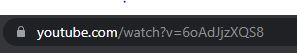

# Youtube Videos Helper

## Description

videos helper is a tiny library that helps you get normalized and customized data of the videos fetched from youtube.
You can supply your own categories and the videos fetched will be added to your custom categories.

## Installation

```js

npm i youtube-videos-helper

```

## Using the library

### Step 1

You need to have youtube id's of the videos that the details of.
You will get the id's from the end of the URL when you play a particular video.



Whatever you see after `?v=` is the id of youtube video.

You need to collect id's of all such youtube videos that you want to be a part of your database.

You can store all these id's in an array.

### Step 2

Now define all your categories. The categories can be custom and completely depends on you.

After both these steps your code should look somehting like this:

```js
const CricketDatabase = {
  ipl: ["JnC2zmLTd9A", "ivB5rJv2rsc"],
  worldcup: ["WHDlSWTJ7MM", "7vGsFiOhsF0"],
};
```

You can add as many categories as you want and as many videos as you want in the array of id's.

### Step 3

The database is ready. Now, install the library using the command mentioned in the beginning.

### Step 4

There are 3 helper functions in the package.

You will need only 2 functions initially.

- `getVideoDetails`
- `getNormalizedVideoDetails`

`getVideoDetails`

- `Input Parameter`: It takes the database which should be an array of objects as input

- `Returns`: `Array`.
  The object has 2 members: a pending promise and the corresponding category that you had provided for a particular video in your database.

Now call `getVideoDetails` with the mentioned inputs and store the received output in a variable.

`getNormalizedVideoDetails`

- `Input Paramater`: It takes an object which should have the following properties:

  - `arrayOfPromises`: `Array`
    Whatever output you get from `getVideoDetails` should be assigned to `arrayOfPromises`.
  - `originalViews`: `Boolean`

    If you want the originalViews on that video then pass it as true.

    `Note`: _By default the value is true_

  - `originalLikes`: `Boolean`

    If you want the originalLikes on that video then pass it as true.

    `Note`: _By default the value is true_

- `Returns`: `Array`
  - It returns an array og objects. The object has all the video details and the corresponding category that you had provided in the database.

### Step 5 [Optional]

The `duration` property of the video is standard in ISO_8601 format.
The library function `getFormattedTime` helps you in getting the time in useful format.

`getFormattedTime`

- `Input Paramater`: `string`

  - It takes time in ISO_8601 format.

- `Returns`: `Object`
  It returns you the time in an object as shown below

  ```js
  {hours: `2`, minutes: `12`, seconds: `47`}
  ```

  _Note that the values for hours, minutes and seconds are in string format_
